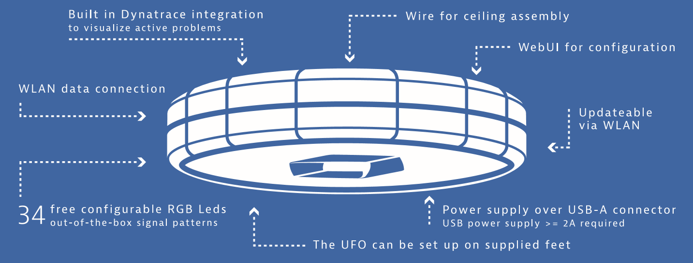
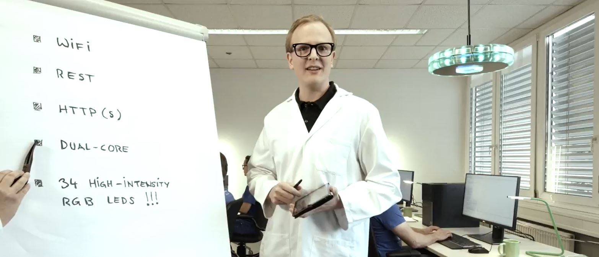
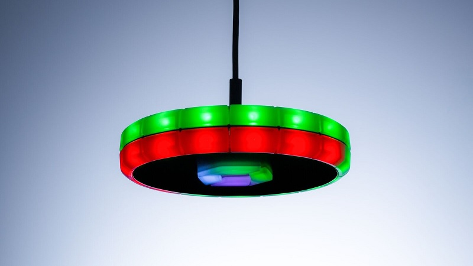
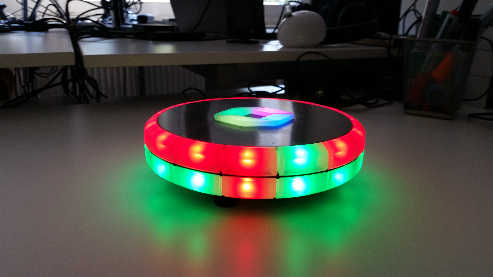

# Dynatrace UFO
The 2nd generation of the Dynatrace UFO runs now with ESP32 microcontroller [(specs)](doc/SPECS.md). Also, since not everyone has the time print, solder and assemble themselves, we have produced a limited batch of ufos for your convienience. [https://dynatrace.com/ufo
](https://dynatrace.com/ufo)

# How can i foster a DevOps culture with the Dynatrace UFO?
## See the status of your CI and DevOps process in real-time
For companies that face the challenges of a distributed team, the Dynatrace DevOps UFO is a highly visible IoT gadget to share the status of a project. Using our UFOs, a quick stroll through the office, or a glance to the other side of the room, can alert you to problems.
## Improve quality and protect digital performance
The UFO monitors progress at every stage of the continuous delivery process, with a separate device for each team or feature. If there are issues that impact getting a build completed, such as code that doesn’t compile, the LEDs turn red.

[ https://www.youtube.com/watch?v=6z9BTHhvWSU](https://www.youtube.com/watch?v=6z9BTHhvWSU)

## Any other visualization need...
Since the UFO has an open REST interface you can use it freely for any other visualization need. For the nerds amongst you, the UFO is also open source. So at your own risk, you are free to hack the UFO for any of your own visualization needs. 

# How do I use the UFO?
## Hanging - Cafeteria, Hallway use.....

Note: Assembly of the UFO (in particular mounting the device on the ceiling) may only be carried out by qualified personnel. 

## Desktop - Office desk, ...

* mount the 3 rubber feet that came in the box with the UFO
* slide the stabilizing tube along the cable towards the USB plug, so you can bend the cable properly

# Configuring the UFO

## Wifi
When you have not configured a wifi endpoint in the web-interface yet or every time you press the button on the top, the UFO starts up in Ad-Hoc mode which is symbolized by blue flashing LED rings. The SSID is "Ufo" and the IP address 192.168.4.1. Use a notebook, tablet or phone to connect to the "Ufo" net and open "http://192.168.4.1/" in a browser. This will open up the web-interface of the UFO where you now can configure your Wifi setting. After applying the settings the UFO will restart and try to connect to the configured Wifi, which is symbolized by yellow flashing LED rings. Once a connection has been made the LED display starts to display the retrieved (DHCP) IP address. If this does not succeed switch back to Ad-Hoc mode and check the settings.

If the connections succeeds there are several options to connect to the UFO:
* Option 1: Open your browser, make sure its connected to the same Wifi as the UFO. Goto <a href="http://ufo">http://ufo</a>

If that doesnt work you will need to use `http://<ipaddress>`.

There are multiple ways to discover the IP address of the Dynatrace UFO in case you need it:
* The rings visualizes the current IP address digit by digit. 192.168... will light 1 LED then 9 (5+4)	then 2 and so on. A dot is visualized as 3 white LEDs. The individuL digits are separated by a short white flash. The IP is visualized over and over again until the first api rest call is issued. To stay in sync every IP address visualization run uses a different color.
* After a successful connection to the Wifi switch back to Access Point mode (push the button) and look at the info section for the latest IP adress retrieved by DHCP.
* Lookup the MAC address in your Wifi Access Point and get the IP address assigned by DHCP

## API
All LEDs can be controlled through an API. By calling the API, you can separately control the bottom row, the top row
and the 4 LEDs that show the Dynatrace logo.

#### Controlling the logo
The four LEDs that form the Dynatrace logo can be given different colors using the following API query parameter:

`logo=<color>|<color>|<color>|<color>`

Example where the colors will be set to red, green, blue and white:

`/api?logo=ff0000|00ff00|0000ff|ffffff`

To reset the colors back to its initial state, execute the following API call:

`/api?logo_reset`

#### Controlling the top row
All 15 LEDs of the top row can be controlled using the `top` query parameter in the API call. The format is as follows:

`top=<starting LED>|<number of LEDs>|<hex color>`

Examples:
- Turn all LEDs red on the top row: `/api?top=0|15|ff0000`
- First seven LEDs red, the rest green: `/api?top=0|7|ff0000&top=7|8|00ff00`

To reset the row back to its black state, execute the following API call:

`/api?top_init`

The backgroud color (default is black) can be set by `top_bg=<hex color>`

#### Controlling the bottom row
Controlling the LEDs on the bottom row works similar as the top row. Instead of using the `top` query parameter, it should
be renamed to `bottom`.

#### Animations
Besides having static colors, it is also possible to add some animations, like:
- morph - from foreground to background and back
- whirl - rotate either clockwise, or counter clockwise

##### Morph
`<row>_morph=<period>|<speed>`

First parameter indicates the period between the morphs. The seconds parameter is the speed of the morph, where the
maximum speed is 10.

Example:

`/api?top=0|15|00ff00&top_morph=80|8`

##### Whirl
`<row>_whirl=<speed>|<direction>`

First parameter indicates the speed of the whirl, with a maximum of 255. The second parameter indicated if it should go 
clockwise, or counter clockwise. The default here is clockwise. If the opposite is needed, the direction parameter has 
to be set to `ccw`.

Examples:
- Have two blue LEDs go around over a green circle in a clockwise direction: 
`/api?top_bg=00ff00&top=0|2|0000ff&top_whirl=240`

# Firmware

## Update

## Nerd Zone
[Firmware build instructions](doc/BUILD.md)

# Legal Stuff

Dear Customer,

Please read the operating instructions carefully before putting into operation for the first time.

* The UFO device may only be operated with a USB power adapter with a voltage of 5V and at least a 2A DC. Only use power adapters that are legally approved for the respective country.

* Connecting the UFO device to your PC or laptop requires a special development environment, which is permitted only to trained developers. The user is liable for any possible damage to the PC or UFO.

* Avoid using USB extension cables, as this may lead to the UFO being damaged or displaying unwanted behaviour.

* Assembly of the UFO (in particular mounting the device on the ceiling) may only be carried out by qualified personnel.

* The UFO is to be used exclusively in interior spaces.

### WARRANTY:

1.1. Limited Warranty. Dynatrace warrants to Buyer that, for a period of 90 days from the date of shipment of the Goods, such Goods will materially conform to Dynatrace’s published specifications in effect as of the date of manufacture.

1.2. Disclaimer. EXCEPT FOR THE WARRANTY SET FORTH IN SECTION 1.1 ABOVE, DYNATRACE MAKES NO WARRANTY WHATSOEVER WITH RESPECT TO THE GOODS, INCLUDING ANY (A) WARRANTY OF MERCHANTABILITY; (B) WARRANTY OF FITNESS FOR A PARTICULAR PURPOSE; (C) WARRANTY OF TITLE; OR (D) WARRANTY AGAINST INFRINGEMENT OF INTELLECTUAL PROPERTY RIGHTS OF A THIRD PARTY, WHETHER EXPRESS OR IMPLIED BY LAW, COURSE OF DEALING, COURSE OF PERFORMANCE, USAGE OF TRADE OR OTHERWISE.

